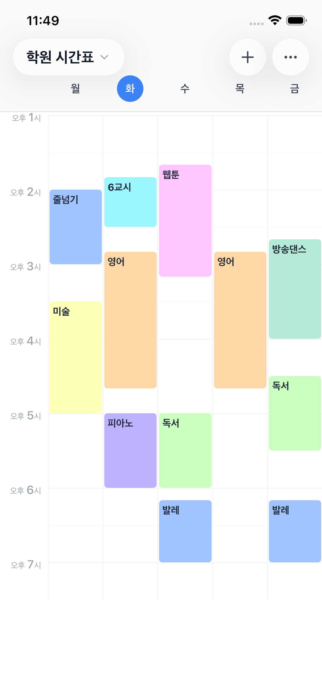

# Weeky

주간 시간표를 직관적으로 관리하는 모바일 앱입니다.
드래그로 일정을 이동하고, 여러 시간표를 손쉽게 전환할 수 있습니다.



## 주요 기능

- **주간 시간표** — 월~일 7열 그리드로 한눈에 보는 주간 일정
- **드래그 편집** — 일정 블록을 드래그해 시간/요일 이동, 상하 핸들로 길이 조정
- **멀티 시간표** — 학교/학원/직장 등 여러 시간표를 좌우 스와이프로 전환
- **반복 일정** — 매주 반복 일정, 다중 요일 선택 지원
- **로컬 알림** — 일정 시작 전 5/10/15/30분 알림
- **공휴일 연동** — 공공데이터포털 API로 공휴일 자동 표시
- **화면 줌** — 핀치 제스처로 최대 2배 확대
- **인쇄 & 공유** — AirPrint 인쇄, PNG 이미지로 공유

## 기술 스택

| 분야 | 기술 |
|------|------|
| 프레임워크 | React Native 0.84.0 (New Architecture) |
| 언어 | TypeScript |
| 스타일링 | NativeWind v4 + Tailwind CSS v3 |
| 네비게이션 | React Navigation v7 (Native Stack) |
| 로컬 저장 | react-native-mmkv (NitroModules 기반) |
| 애니메이션 | react-native-reanimated v4 + react-native-worklets |
| 알림 | @notifee/react-native |
| UI 효과 | @callstack/liquid-glass (iOS 18+) |
| 이미지 공유 | react-native-view-shot + react-native-share |
| 인쇄 | react-native-print |
| 트래킹 | react-native-appsflyer |

## 프로젝트 구조

```
src/
├── components/
│   └── timetable/
│       ├── constants.ts               # 공유 상수 및 헬퍼 함수
│       ├── DraggableScheduleBlock.tsx # 드래그 가능한 일정 블록
│       ├── GlassIconButton.tsx        # Liquid Glass 헤더 버튼
│       ├── HeaderContainer.tsx        # 헤더 타이틀 & 페이지 인디케이터
│       ├── TimetableShareView.tsx     # PNG 캡처 & 공유 뷰
│       └── renderBackdrop.tsx         # BottomSheet 백드롭
├── navigation/
│   └── RootNavigator.tsx              # Stack 네비게이터 설정
├── screens/
│   ├── MainScreen.tsx                 # 주간 시간표 메인 화면
│   ├── ScheduleFormScreen.tsx         # 일정 추가/편집 모달
│   └── SettingsScreen.tsx             # 시간표 설정 화면
├── store/
│   ├── mmkv.ts                        # MMKV 저장소 초기화
│   ├── timetableStore.ts              # 시간표 데이터 저장/로드
│   ├── settingsStore.ts               # 설정 데이터 저장/로드
│   └── holidayStore.ts                # 공휴일 캐시 저장/로드
├── types/
│   └── index.ts                       # Schedule, Timetable, HolidayInfo 타입
└── utils/
    ├── time.ts                         # 시간 변환 유틸
    ├── notification.ts                 # 로컬 알림 설정
    ├── holidayApi.ts                   # 공공데이터포털 API 연동
    ├── printHtml.ts                    # 인쇄용 HTML 생성
    ├── appsflyer.ts                    # AppsFlyer SDK 초기화
    └── cn.ts                           # Tailwind className 유틸
```

## 시작하기

### 요구 사항

- Node.js 20.x 이상
- Xcode 15+ (iOS 빌드 시)
- Android Studio (Android 빌드 시)
- CocoaPods

### 설치

```bash
# 의존성 설치
npm install

# iOS Pod 설치 (bundle exec 대신 직접 실행)
cd ios && pod install && cd ..
```

### 실행

```bash
# Metro 번들러 시작
npm start

# iOS 시뮬레이터 실행
npm run ios

# Android 에뮬레이터 실행
npm run android
```

## 데이터 구조

### Schedule

```typescript
{
  id: string
  title: string           // 일정 이름
  subTitle?: string       // 부제 / 장소
  memo?: string           // 메모
  dayOfWeek: number[]     // 0=월 ~ 6=일
  startTime: string       // "HH:MM"
  endTime: string         // "HH:MM"
  color: string           // 16진 컬러
  isRepeating: boolean    // 매주 반복 여부
  notification?: {
    enabled: boolean
    minutesBefore: 0 | 5 | 10 | 15 | 30
  }
}
```

### Timetable

```typescript
{
  id: string
  name: string              // 시간표 이름
  order: number             // 탭 순서
  schedules: Schedule[]
  timeRangeStart?: string   // 기본값: '07:00'
  timeRangeEnd?: string     // 기본값: '23:00'
  showWeekends?: boolean    // 기본값: false
  holidaySync?: boolean     // 기본값: false
}
```

## 빌드 & 배포

### iOS (Azure Pipelines)

`deploy/ios` 브랜치에 푸시하면 자동 빌드됩니다.

```
deploy/ios 푸시
  → npm ci
  → pod install
  → Xcode Archive (Release)
  → Firebase App Distribution (테스터 배포)
  → TestFlight 업로드
```

필수 Variable Group: `weeky-ios-secrets`

| 변수명 | 설명 |
|--------|------|
| APPLE_CERTIFICATE_P12_BASE64 | 코드 서명 인증서 (Base64) |
| APPLE_CERTIFICATE_PASSWORD | 인증서 비밀번호 |
| APPLE_TEAM_ID | Apple 팀 ID |
| FIREBASE_APP_ID | Firebase 앱 ID |
| FIREBASE_TOKEN | Firebase CLI 토큰 |
| APP_STORE_CONNECT_KEY_ID | App Store Connect API 키 ID |
| APP_STORE_CONNECT_ISSUER_ID | App Store Connect 발급자 ID |
| APP_STORE_CONNECT_KEY_P8_BASE64 | App Store Connect API 키 (Base64) |

### Android (GitHub Actions)

`deploy/android` 브랜치에 푸시하면 빌드가 트리거됩니다.

## 개발 규칙

- 새 기능 추가/변경 시 `spec/spec.md`를 함께 업데이트한다.
- 스타일링은 NativeWind v4 className을 사용한다.
- 1파일 1컴포넌트 원칙을 지킨다.
- iOS pod install은 `pod install` 직접 실행 (`bundle exec pod install` 사용 금지).
- `react-native-mmkv` 설치 시 `react-native-nitro-modules`도 함께 설치한다.
- `react-native-reanimated` v4.x 설치 시 `react-native-worklets`도 함께 설치한다.
